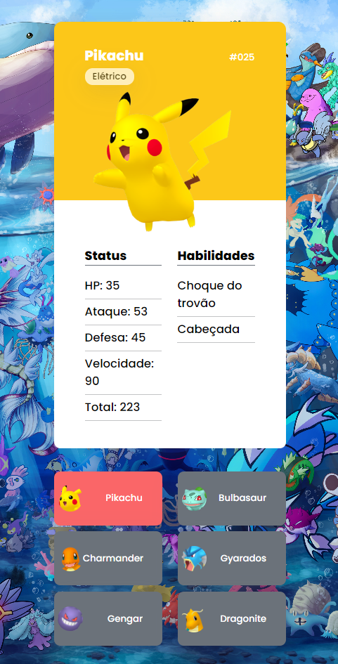

# Pokédex 🐛

> Projeto desenvolvido no evento MapaDev Week para a criação de uma simples pokédex que contém informações de 6 pokémons selecionavéis utilizando modelo de card. 💻

## 🎨 Mobile

[🔗 Clique aqui para acessar](https://brunakarina.github.io./pokedex/)

## 🚀 Tecnologias

- HTML
- CSS
- JavaScript

## 📫 Contato

brubskarina@gmail.com
